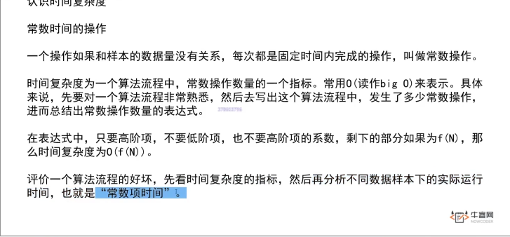
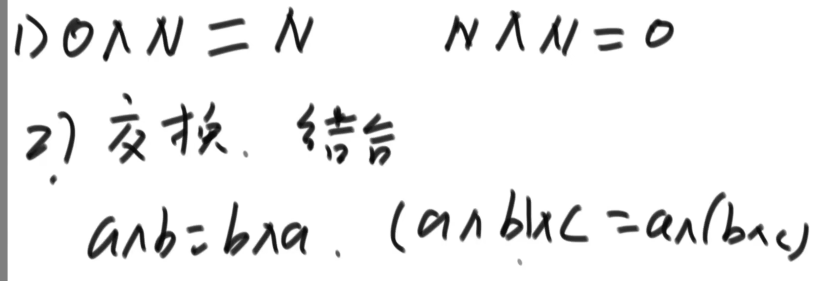
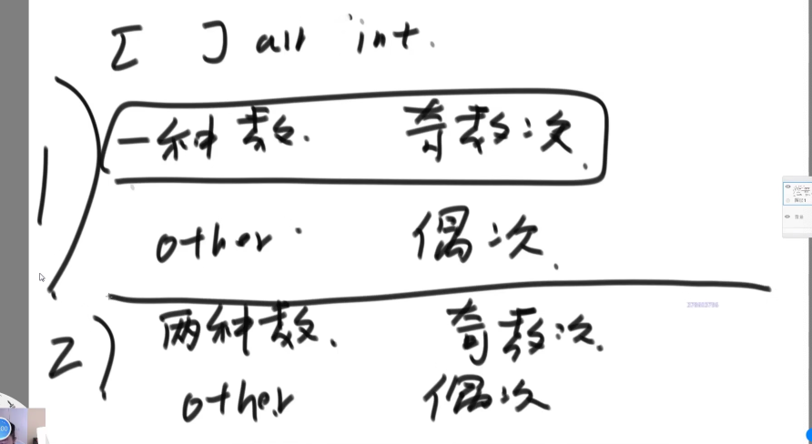
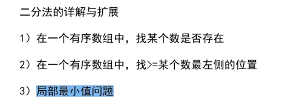
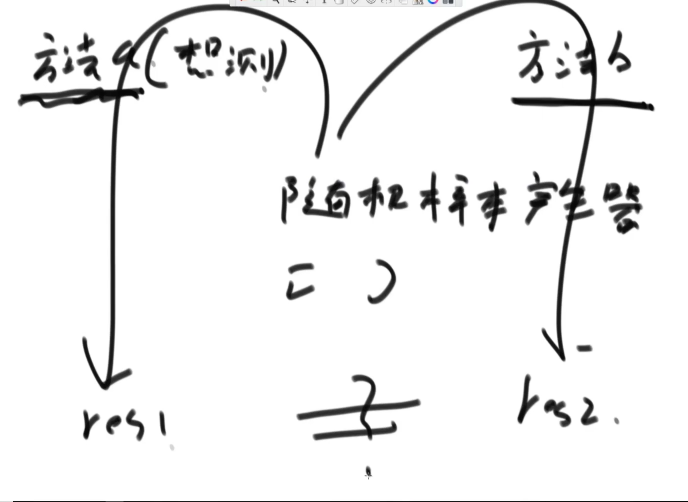
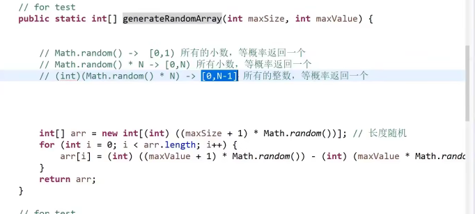
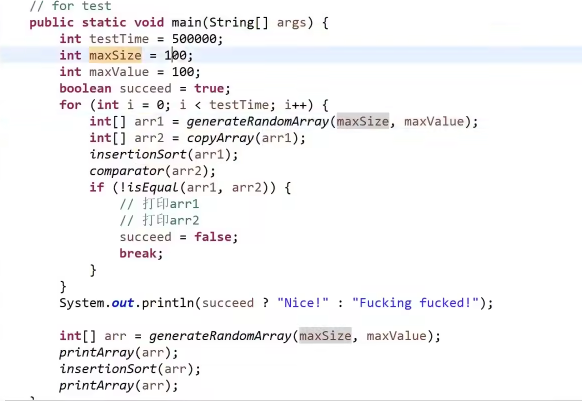

## 时间复杂度
> 1. 常数操作次数
>  
> 2. golang 有无三目运算符？
***
## 排序方法
>1. 选择排序：选最小的元素从左往右依次排列 O（n平方）
>2. 冒泡排序：两两比较，大的右移，每次最大的元素最终排到末尾 O（n平方 ）
>3. 异或运算：相同为0不同为1
>>
>用处：交换两个数的值
`a = a ^ b ;
b = a ^ b;
a = a ^ b`
     （面试题）：
> 
>位运算提取最右侧的1:` int rightOne = eor & (~eor + 1)`
>4. 插入排序：依次使得0～n有序，从n开始向前比较，若小则交换 O（n平方 ）**根据最差情况进行估计**
>5. 二分法 
> 
>6. 对数器 
>> 
> 产生一个随机数组（长度随机，值也随机）
> 
> 