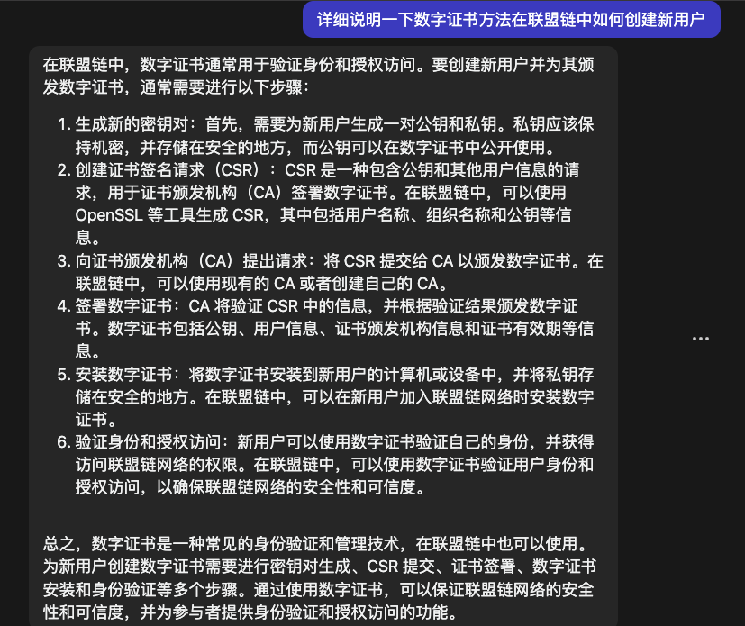
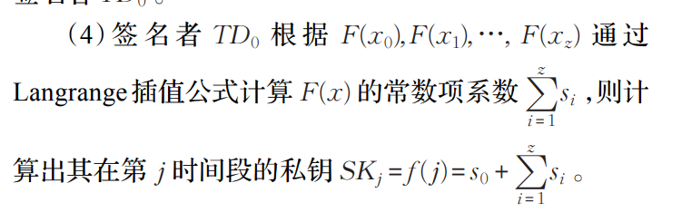
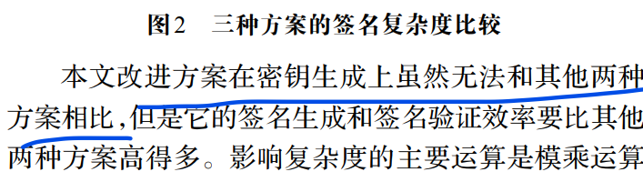

## 前向安全ECC数字签名方案
### 分类
> - 双线性配对
> - ECC（关联因子）
> - ECC（Guillou-Quisquater & Rabin）
> - 基于身份（Chebyshev）
> - **周克元：具有消息回复功能的ECC签名方案（兼顾前向安全性）**
> - 基于EIGmal体制的（单项散列链）
### 概念
> -前向安全性
> 随机预言模型
> 概率多项式时间算法
> ECDSA
### 前向安全体制
****
### 计算私钥的分布式协议
1. 每个TD选取随机z元变量构建z次多项式
2. **通过保密信道将H（x）发送TD**
3. TD计算共享份额，发送给签名者TD0
4. 
### 分析
1. 前向安全性的核心思想是将私钥分为不同的时间段进行修改，使得每个时间段的
私钥不相同，其当前时间段的私钥是通过前一个时间段的私钥根据计算函数生成，**改论文选取
随机z次多项式进行分布可信方。**
2. 假设Singer 和TD 存在保密信道，可以进行Secret transfer,
3. Langrenge插值进行计算，相较于Netwn插值？
4. 签名者TD0使用拉格朗日插值计算常数项系数，TD0可信？
5. 第j各时间段的私钥如何与公钥进行配对？
6. 两种签名方案以及验证？
7. 
8. 