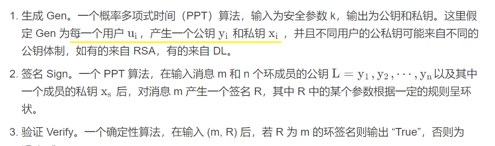

### 国内外研究现状
> 数据孤岛
> Cachin联盟链身份认证机制

### 研究重点
> 如何在跨链网络中为不同的链提供统一的身份标识（解决认证问题）  
> 如何保护跨链交易中的身份信息  
#### 聚焦问题
身份管理研究现状、跨链身份授权研究现状

### 文章贡献
提出一种基于**群签名**的跨链交易模型（中继链）

### Cross-chain manner
> - 公证人机制
>> 中心化风险
> - 侧链
>> 增加网络复杂度、新的安全风险？
> - 中继链
> - 哈希锁定
> - 分布式私钥控制
>> 应用局限性
> 
### 知识拓展
>群签名  
>>在一个群签名方案中，一个群体中的任意一个成员可以以匿名的方式代表整个群体对消息进行签名。与其他数字签名一样，群签名是可以公开验证的，而且可以只用单个群公钥来验证  

>环签名  
>> 环签名 (ring signature) 是一种数字签名方案，最初由 Rivest 等人提出，环签名是一种简化的群签名，环签名中只有环成员没有管理者，不需要环成员间的合作。
> 