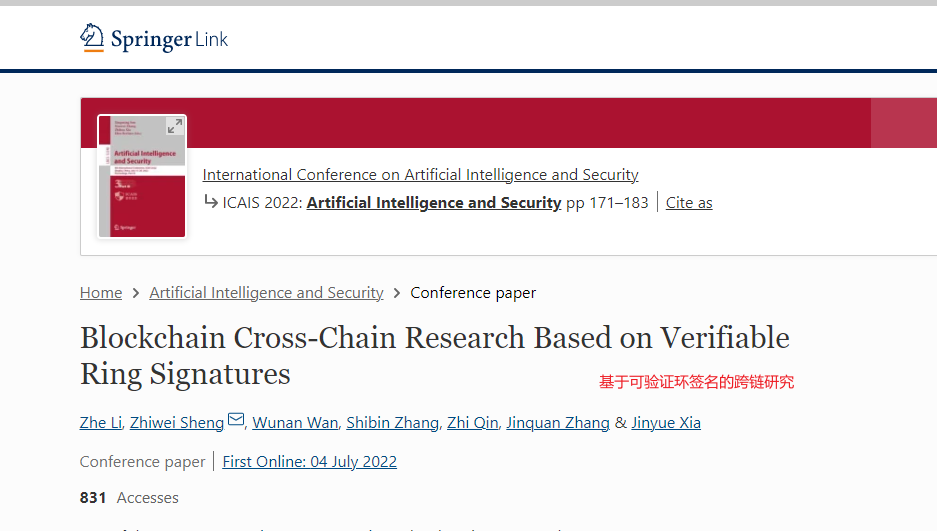

### 行文思路
1. 基于（）设计（或实现）跨链模型
2. 针对该模型存在的[隐私问题]()
3. 安全性证明 or 仿真测试得出实验结果

### 文章结构
- 引言
- 国内外研究现状
- 本文主要工作
- 相关方法原理简介
- 本文系统架构介绍
- 本文系统隐私保护机制研究以及算法证明
- 实验数据或安全性证明
- 参考文献

### 跨链过程中需要解决的问题
>1. 加入跨链网络用户的身份认证、资产确权
>2. 交易时的身份认证、交易验证转发,异构链支付验证
>3. 每个用户具有唯一的标识
>4. 可选（匿名交易？并保证匿名不被滥用）
>5. 签名（若有）安全性验证：一个不合法的签名不可能使等式成立

### 选题
1. 基于适配器签名的联盟链跨链隐私保护方案
2. [改进（前向安全性）群签名的联盟链跨链隐私保护技术](https://github.com/WenQiang404/StudyNotes/blob/c8f06f97054fd2898add9b62db467265e517f158/Passages/%E5%9F%BA%E4%BA%8E%E7%BE%A4%E7%AD%BE%E5%90%8D%E7%9A%84%E8%81%94%E7%9B%9F%E9%93%BE%E8%B7%A8%E9%93%BE%E9%9A%90%E7%A7%81%E4%BF%9D%E6%8A%A4%E6%8A%80%E6%9C%AF.md)
> - 群管理员权力削弱、密钥分发机制修改  
> - 该文章的群签名算法实现联盟链跨链隐私保护方案，群管理员拥有群成员密钥对（中心化，安全风险）  
> - 环签名已有研究：
> 
> - 考虑使用前向安全性椭圆曲线数字签名方案改进群签名算法，
> 群管理员不再拥有每一位群成员的公私钥对，而是确认身份
> 后，群成员私钥改变，群管理只保存每一位群成员的公钥，
> 无法获悉相应私钥，在进行资产交易涉及身份认证时，
> 群成员向群管理发送身份信息，身份与公钥一一对应，
> 群管理用公钥加密验证消息返回，若用户能够正确解密，
> 则完成身份验证。密钥对使用方面再做改进？待分析