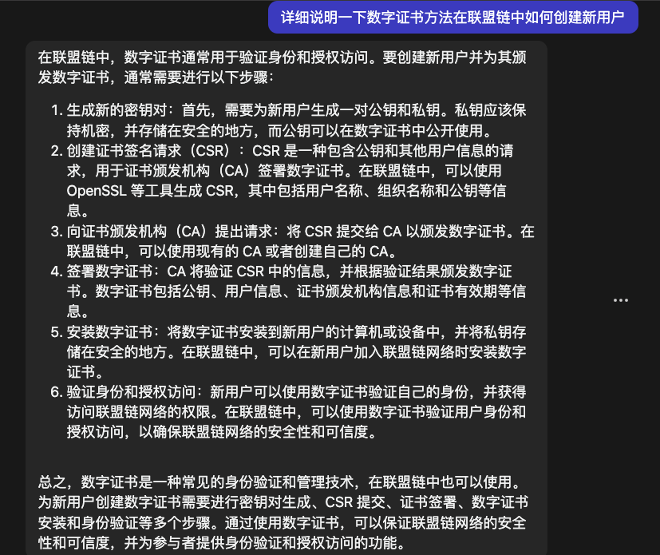

### 行文思路
1. 基于（）设计（或实现）跨链模型
2. 针对该模型存在的[隐私问题]()
3. 安全性证明 or 仿真测试得出实验结果

### 文章结构
- 引言
- 国内外研究现状
- 本文主要工作
- 相关方法原理简介
- 本文系统架构介绍
- 本文系统隐私保护机制研究以及算法证明
- 实验数据或安全性证明
- 参考文献

### 跨链过程中需要解决的问题
>1. 加入跨链网络用户的身份认证、资产确权
>2. 交易时的身份认证、交易验证转发,异构链支付验证
>3. 每个用户具有唯一的标识
>4. 可选（匿名交易？并保证匿名不被滥用）
>5. 签名（若有）安全性验证：一个不合法的签名不可能使等式成立
>6. 跨链请求是否真实
>7. 验证者私钥管理
>8. 跨链协议验证人劫持（用户节点来充当验证节点）
>9. 状态同步更新

### 选题
1. 基于适配器签名的联盟链跨链隐私保护方案
2. [改进（前向安全性）群签名的联盟链跨链隐私保护技术](https://github.com/WenQiang404/StudyNotes/blob/c8f06f97054fd2898add9b62db467265e517f158/Passages/%E5%9F%BA%E4%BA%8E%E7%BE%A4%E7%AD%BE%E5%90%8D%E7%9A%84%E8%81%94%E7%9B%9F%E9%93%BE%E8%B7%A8%E9%93%BE%E9%9A%90%E7%A7%81%E4%BF%9D%E6%8A%A4%E6%8A%80%E6%9C%AF.md)
> - 群管理员权力削弱、密钥分发机制修改  
> - 该文章的群签名算法实现联盟链跨链隐私保护方案，**群管理员拥有群成员密钥对**（中心化，安全风险）  
> - 环签名已有研究：
> 
> - 考虑使用前向安全性椭圆曲线数字签名方案改进群签名算法，
> 群管理员不再拥有每一位群成员的公私钥对，而是确认身份
> 后，群成员私钥改变，群管理只保存每一位群成员的公钥，
> 无法获悉相应私钥，在进行资产交易涉及身份认证时，
> 群成员向群管理发送身份信息，身份与公钥一一对应，
> 群管理用公钥加密验证消息返回，若用户能够正确解密，
> 则完成身份验证。密钥对使用方面再做改进？待分析
> - 如何让群主在私钥变化的同时依旧可以追踪到签名者的信息？（群成员签署签名时将自己的H(Message)一并加入签名中）

### 参考资料

### 设计过程
#### 相关流程设计
> 1. 用户（普通用户+公证人群组）匿名加入联盟链，身份监管防止匿名滥用：
> > 无法获悉公证人身份，从而应对针对公证人的攻击；且身份匿名，保护身份隐私。
> 
>  联盟链拥有自己的CA机构，用于新加入用户节点的身份授权以及公证人选举，公私钥分发等功能，**同时作为群签名算法的群主**。
> 
> **用户加入联盟链**：
> 
> - 向CA发起创建证书签名请求CSR，本地生成自己的公私钥对（OpenSSL）
> - CA向用户发送H(X):SM3计算方法
> - 用户将H{身份信息（邮箱地址）}「**以下称作身份哈希值，用于唯一确定用户身份**」+公钥等发送给CA
> - CA验证CSR，根据结果颁发数字证书，其中数字证书包括：身份哈希值、公钥、用户信息、CA信息以及有效日期、时间戳
> - CA保存身份哈希值，每一个哈希值对应一个用户
> - 用户安装数字证书，妥善保存私钥
> - 使用数字证书验证自己的身份，加入联盟链网络进行交易  
> 
>
> **CA确定公证人群成员**：
> 
> - CA机构作为群主，生成群公钥(Pkc)和k个群成员私钥(Skc)「选取k个大素数，计算出群公钥与大素数乘法群的生成元」
> - 新增群成员：
> - - 根据哈希值列表随机选择k个用户节点作为公证人节点（n > Total_Node * 0.01）
> - - 为每一个群成员分配群成员私钥和证书。证书用于证明成员身份，主要包括身份哈希值，时间戳
> - - 若有新加入的成员，则向CA申请，CA选取私钥后计算公钥并更新群公钥，发送私钥至新群成员
>
> - 撤销群成员：
> - - CA广播消息：群成员更新私钥，限制输入条件。拒绝向身份哈希为待撤销成员的地址发送共享份额Sa,则该成员无法更新私钥，撤销成功。
> - 
> - 
