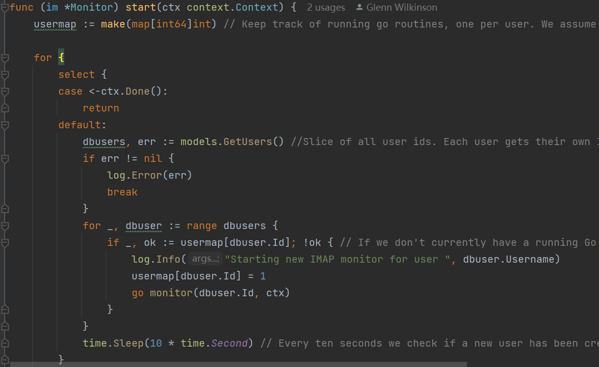

### 问题描述
Gophish默认使用SQLite进行数据存储，重启服务器发现ID全部消失
### 问题原因
如果在重启服务器后，SQLite 数据库文件丢失或不可用，那么 Gophish 将无法访问以前的 ID 数据。
为了避免这种情况发生，可以将 Gophish 的数据存储方式切换为 MySQL 或 PostgreSQL 等可靠的数据库管理系统，确保数据库服务器在重启后能够正确启动并保留数据。此外，建议对 Gophish 数据进行定期备份以防数据丢失。 
若只使用SQLite进行数据存储，可采取数据持久化的措施来避免ID丢失问题，具体步骤：
1. 在生产环境中使用 Gophish。Gophish 官方文档建议只在测试和开发环境中使用 SQLite，生产环境应该使用 MySQL 或 PostgreSQL 等更可靠的数据库管理系统。
2. 定期备份 SQLite 数据库文件。可以使用脚本定期备份 SQLite 数据库文件，并将备份文件保存到其他位置，以防止文件丢失。
3. 将 SQLite 数据库文件放在可靠的位置。可以将 SQLite 数据库文件放在可靠的位置，如 /var/lib/gophish/，并确保该目录具有适当的文件系统权限，以防止文件被意外删除或更改。
4. 避免在服务器重启时丢失数据。在重启服务器之前，可以使用命令行或脚本将 SQLite 数据库文件备份到另一个位置，然后在服务器重新启动后将备份文件恢复到原始位置。

### 问题解决步骤

1. 启动Gophish服务存在：mysql服务配置文件问题、时间区不匹配问题（已解决）
2. 阅读文档发现问题根源：自动为每一个用户生成一个ID字段，如果字段丢失则404

### 工作进展
1. 搭建Gophish服务
2. 发送钓鱼邮件成功:  testgophish@sina.com
3. 分析源码
4. 可能出现问题的位置：

 
IMAP：第87行Removelogs方法

