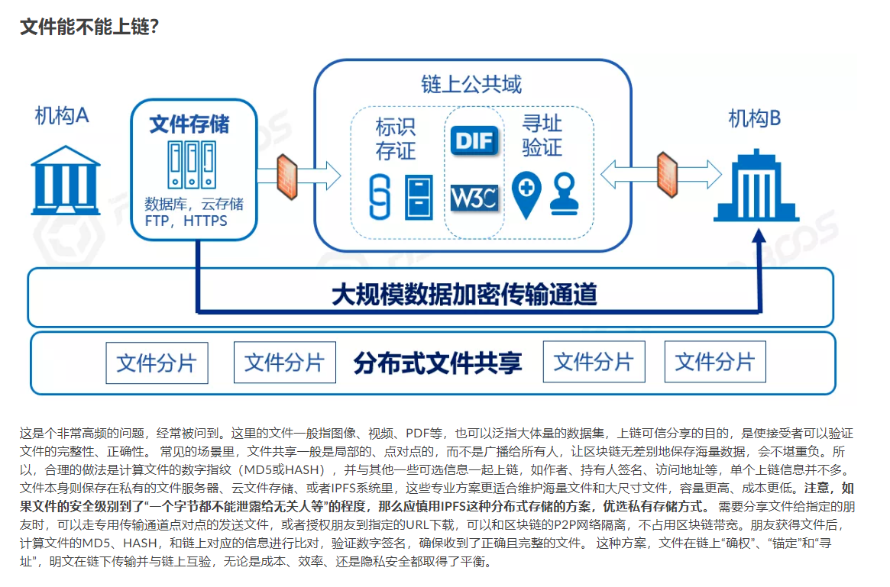

### FISCO BCOS introduction
FISCO BCOS是由国内企业主导研发、对外开源、安全可控的**企业级金融联盟链**底层平台

### 文件存储

### [批量查询和存储数据](https://fisco-bcos-doc.readthedocs.io/zh_CN/latest/docs/articles/1_conception/on_and_off_the_blockchain.html#id6)

### [链下信息可信上链](https://fisco-bcos-doc.readthedocs.io/zh_CN/latest/docs/articles/1_conception/on_and_off_the_blockchain.html#id9)
预言机

### [数据治理](https://fisco-bcos-doc.readthedocs.io/zh_CN/latest/docs/articles/1_conception/on_and_off_the_blockchain.html#id10)
### 流程
1. 展示启动链的过程以及节点状态，并说明数据含义
2. 介绍区块链相关概念，以及FISCO BCOS
3. 展示智能合约代码
4. 说明数据存储，hash，共识
4. FISCO支持多语言SDK，
5. 